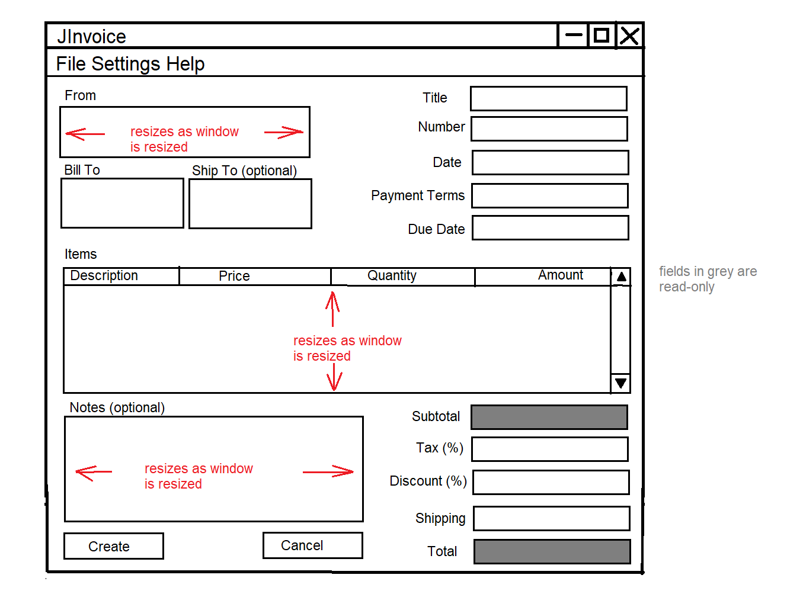
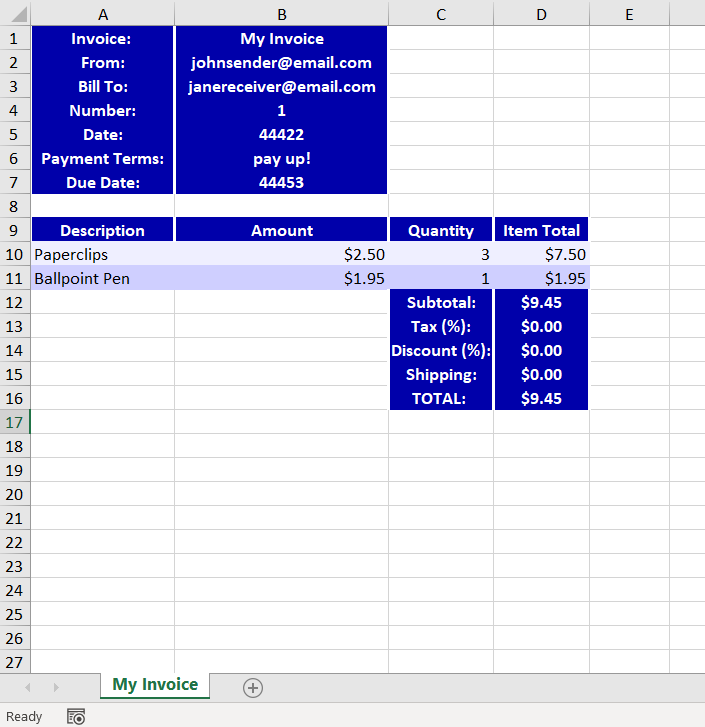

# JInvoice
## Introduction
This is a simple Java Swing invoice generator application. It allows the user to enter the details of the invoice in a form, and generate a Microsoft Excel spreadsheet or PDF document with the invoice information. The user interface has a minimalist and functional design. The development of this application is primarily for the purposes of programming practice, but it may be suitable for real-world use as well.

## Requirements
### R-1
The application must be cross-platform on Windows, Mac and Linux.

### R-2
Invoices must comprise the following information:
- Title
- From (sender)
- To (receiver)
- Ship to (as optional field)
- Invoice number
- Date
- Due date
- Payment terms
- A list of items with: description, price and quantity
- Notes (as optional field)
- Calculated subtotal
- Adjustable (or flat) tax rate
- Discounted
- Shipping cost
- Calculated total

### R-3
Invoices must be able to be generated in PDF or XLSX formats.

### R-4
The initial version will allow only creation of invoices, in either format. Subsequent versions will allow local storage and review of previously-issued invoices.

## Interface Design
### User interface

### Invoice documents
#### Excel

#### Pdf
TODO
## Architectural and Data Design
The application is developed as a Eclipse Java Maven project. The structure of the source code is designed to allow for separation of concerns, and other best practices, as much as possible. This includes provisions for unit-testing of the user interface logic.

The application uses the following open-source libraries:
- Apache POI - for reading and writing Excel documents
- Apache PDFBox - for writing PDF documents

## Release Schedule
### v0.9.0
- functionality to create Excel invoices

### v1.0.0
- functionality to create Pdf invoices

### v2.0.0
- functionality to save and review invoices
